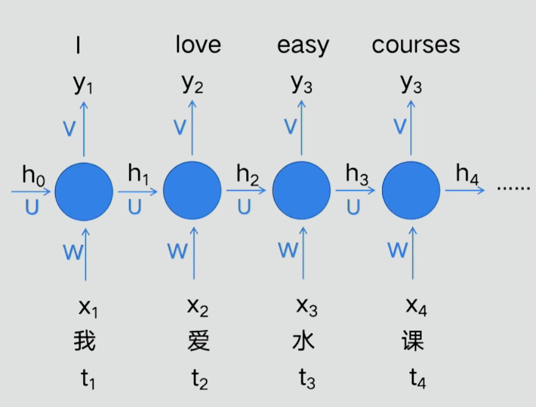
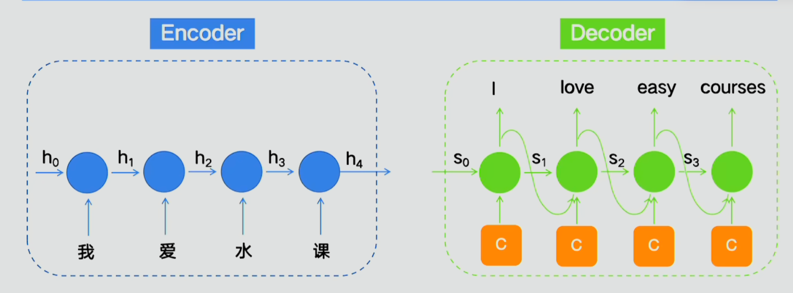
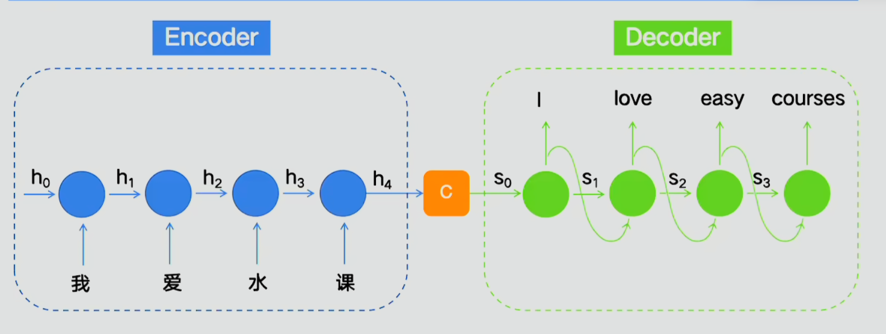

- 编码器
- 解码器
- 注意力机制

前馈神经网络

1. 句子分解成为token词源
2. 词元通过Embedding转化为向量

RNN：缺点只能一个输入对应一个输出

编码器解码器设计思想：缺点会远距离遗忘问题

整体设计结构缺点无法并行计算

词会转化为向量，Transfomer中就是一个512维向量，将全局信息编码到单个词向量上，位置信息额外编码进词向量中

残差连接：当前层训练内容与原始数据组合带入下一层，防止当前层内容质量过低导致下一层扭曲

带掩码的多头注意力机制：目的是防止训练过程中提前获取答案内容，掩码负责压盖后文信息

# 向量

向量加法

向量数乘：向量缩放，用于缩放向量的数成为标量

单位向量 $\hat{i}\hat{j}$，坐标系的基，基向量

描述向量的数，标量对基向量的缩放后相加，数字描述向量都要依赖于所使用的基

两个数乘向量的和成为两个向量的现行组合

两个初始向量恰好共线

张成空间：多个向量通过数乘（缩放）和相加所能表示所有向量的集合，张成->张开形成

线性相关：一个向量恰好落在另外几个向量的张成中，则他们线性相关。一个向量是其他向量的线性组合

线性无关：所有的向量都给张成增添了新的维度

空间的一组基：张成空间的一个无关向量的集合

# 矩阵与空间变换

线性变换：本质是函数的花哨说法，接受内容输出对应结果。直线在变换后依然保持直线，原点必须保持固定

只需记录基向量$\hat{i}\hat{j}$​的变换位置，其他向量都会随之而动

行列式：缩放改变面积的比例，行列式的值代表矩阵对空间的缩放比例
